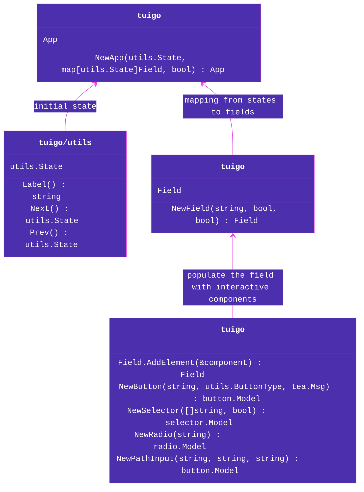

# `tuigo` 

## a terminal UI framework written in Go using the `bubbletea` library.

see `example/` for an example usage of `tuigo`. the scheme below shows roughly the structure of the API.

## TODO

- [ ] customizable theme
- [ ] more components
- [ ] grid structure
- [ ] key help menu
- [ ] field validator