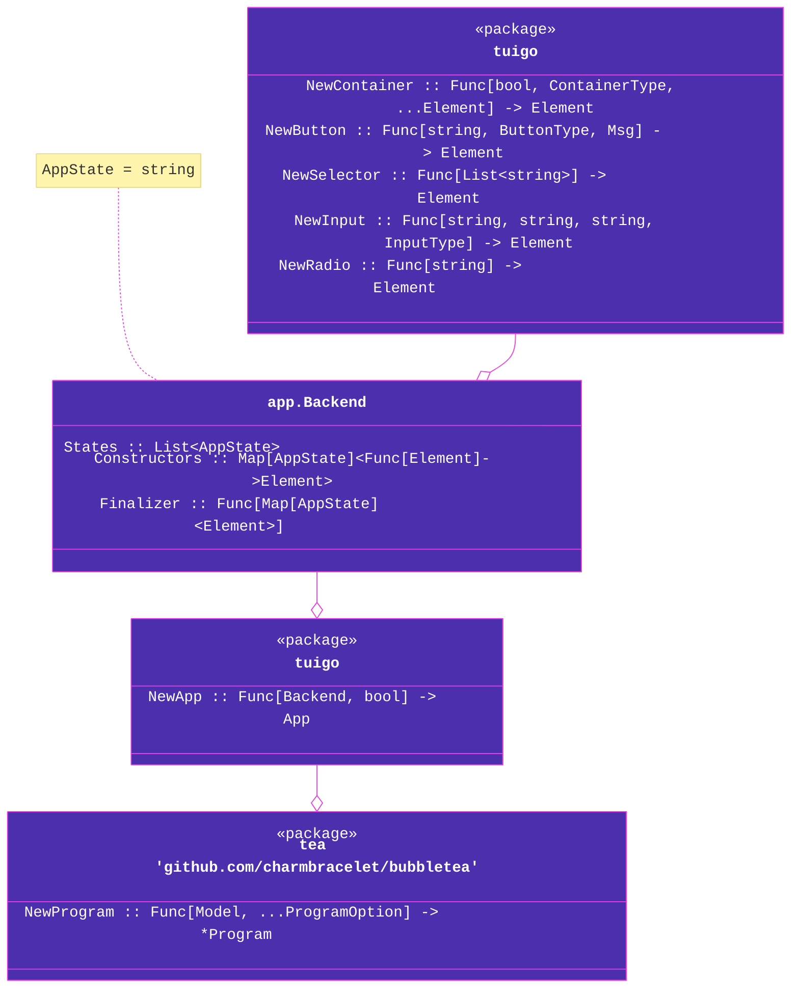

# `tuigo` 

## a terminal UI framework written in Go using the `bubbletea` library.

see [`example/`](example/) for an example usage of `tuigo`. the scheme below shows roughly the structure of the API.

## TODO

- [x] app backend
- [x] grid structure
- [ ] unit tests
  - [x] elements
  - [ ] backend
  - [ ] app
- [ ] customizable theme
- [ ] more components
- [ ] easily accessible components
- [ ] key help menu
- [ ] validators
