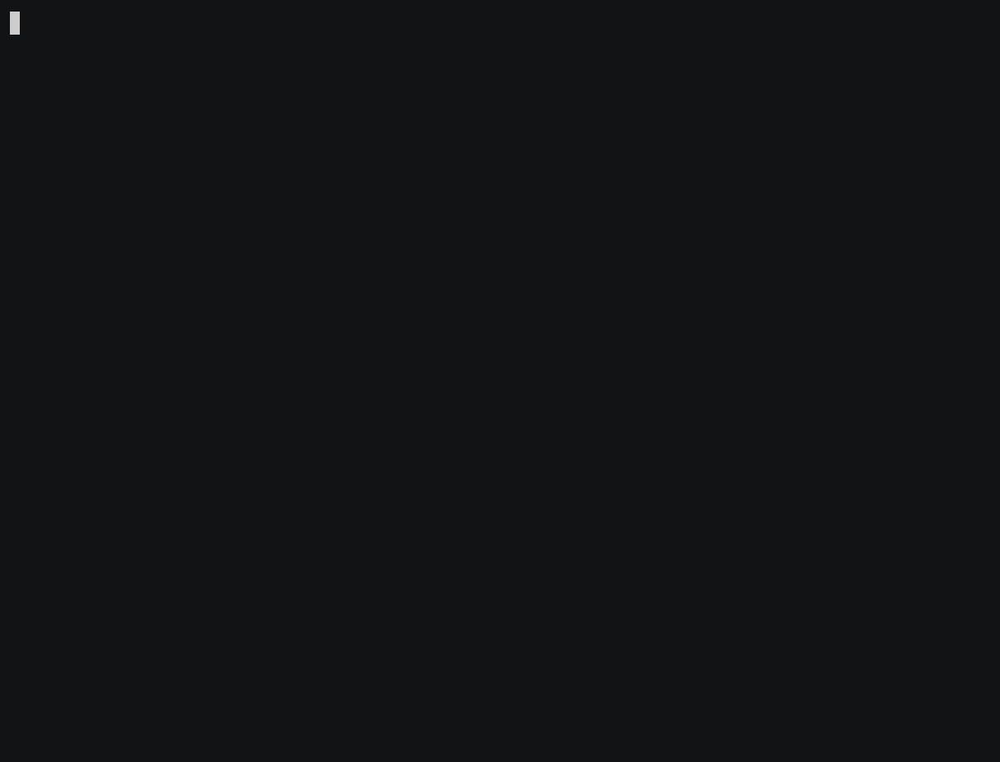

# `tuigo` 

a terminal UI framework written in Go using the `bubbletea` library.

### building an application

the backbone of any application is the `tuigo.Backend` object, which contains all the states of the app, and describes the workflow of changing the states and finalizing the app. the backend object contains the constructors for each "state" of the application (returning an `Element`), and can optionally depend on the previous state (passed as an argument). most of the functions for making new elements are exposed through `tuigo.%Element%`, which return an `Element`. `Container` elements can be nested, while each display element (buttons, selectors, texts, etc) is contained within a parent container. the backend also contains a finalizer function, which is called when the app finishes successfully.

the `tuigo.NewApp` function takes a `Backend` and a boolean value, which determines whether the app should be run in debug mode. the backend is then used to create an app, which is the passed to the `tea.NewProgram`.

see [`examples/`](examples/) for usage examples of `tuigo` for building applications. the scheme below shows roughly the structure of the API. 

### containers

### elements

## TODO

- [x] app backend
- [x] grid structure
- [x] easily accessible components
- [x] update components based on others
- [ ] unit tests
  - [x] elements
  - [x] containers
  - [ ] callbacks
  - [ ] backend
  - [ ] app
- [ ] customizable theme
- [ ] more components
- [ ] key help menu
- [ ] validators
